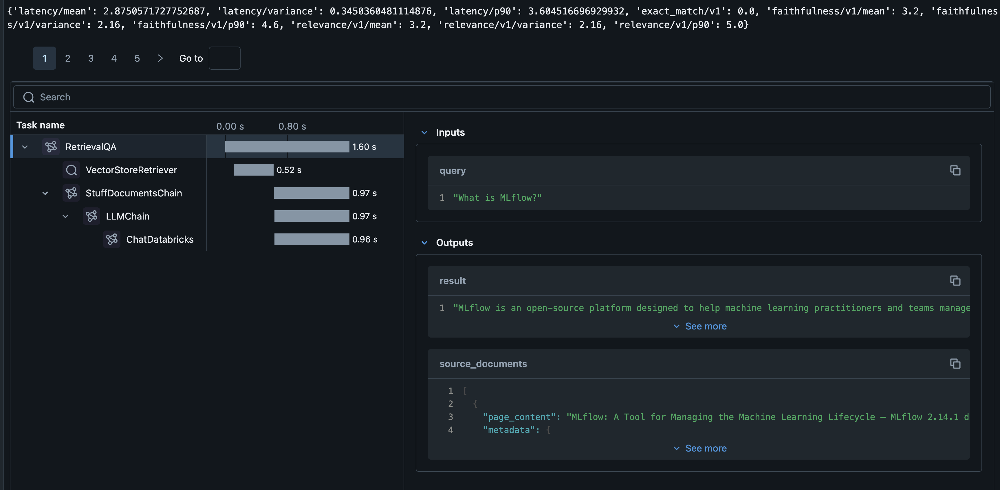

# [WIP] Evaluating Large Language Models with mlflow!

__See the [technical blog](https://community.databricks.com/t5/technical-blog/mlops-gym-evaluating-large-language-models-with-mlflow/ba-p/72815) here for more information!__


[]([https://codecov.io/github.com/willsmithDB/llm-evaluation-mlflow](https://github.com/willsmithDB/llm-evaluation-mlflow))

This collection is meant to get individuals quickly started in evaluating their large language models and retrieval-augmented-generation chains with [mlflow evaluate](https://mlflow.org/docs/latest/llms/llm-evaluate/index.html)!

NOTE: This repo works on Azure Databricks currently and would need slight configuration changes for AWS and GCP. 

# Table of Contents 
-----------

[Get Started](#get-started)  
[Requirements](#requirements)  
[Notebooks](#notebooks)  

-----------

[Examples](#examples)  
[Example with Foundation Model APIs](#foundation-model-apis-and-rag)    
[Example with Langchain for Retrieval-Augmented Generation](#langchain-rag)    
[Example with OpenAI models](#open-ai-models)   

-----------

## Get Started

- Clone the Repo using [Databricks Repos](https://learn.microsoft.com/en-us/azure/databricks/repos/)
- Create cluster config (See Requirements)
- Open the notebooks within Databricks 
- Attach to interactive clusters
- Modify the variables for your personal organization 
- Run notebooks to completion 

-----------

### Requirements

##### Tested with:
- Databricks Runtime: 14.3 LTS ML 
    - (includes Apache Spark 3.5.0, Scala 2.12)
- Driver: Standard_E8_v3  
- Workers: Standard D4ds_V5 [1 - 8]  
- Enable Autoscaling   

##### Python Packages:

`%pip install -U langchain langchain_community langchain_openai databricks-vectorsearch`

- Versions if needed:
```
langchain==0.2.5 
langchain-community==0.2.5 
mlflow==2.14.1 
langchain_openai==0.1.9 
databricks-vectorsearch==0.38
```
-----------

### Notebooks
-----------
##### 1. FMAPI-Langchain-MLflow-Text-QA
- Construct a RAG chain using Databricks Foundation Model APIs! 
    - DBRX
    - Databricks-BGE-Large
- Use Databricks Foundation Model APIs for LLM-as-a-judge.
    - DBRX
    - Llama-3-70b-Instruct 
- Evaluate the chain using mlflow evaluate.
##### 2. Custom-Model-Langchain-MLflow-Text-QA
-----------
##### 3. External-Models-OpenAI-Langchain-MLflow-Text-QA
- Construct a RAG chain using Langchain and Azure OpenAI models. 
    - ChatGPT 3.5 Turbo
    - Text Embedding Ada 002
- Use Databricks Foundation Model APIs for LLM-as-a-judge or ChatGPT. 
- Evaluate the chain using mlflow evaluate. 
-----------
## Examples:  
-----------
#### 1. Foundation Model APIs and RAG

##### Evaluation of RAG (Retrieval-Augmented Generation) chain using Databricks Foundation Model APIs and MLflow!

- We will use langchain to pull MLflow documentation and chunk it. 
- We will use the Databricks Foundation Model APIs to automatically compute embeddings from the chunks. 
- We will then create an index within a Databricks Vector Search index to hold the embeddings and act as a retriever for our RAG chain. 
- DBRX from the Databricks Foundation Model APIs will be our primary model for our RAG chain.
- We log all of this in mlflow so that we can have the run history and associated artifacts stored!
- After creating the RAG chain, we will set up our evaluation metrics including toxicity and faithfulness. 
  - We will be using an additional LLM from the Foundation Model APIs to perform LLM-as-a-judge on our outputs. 
- Finally, we will evaluate our RAG chain and display the results! 

##### Using the Foundation Model APIs is as easy as the following:

```
import os
from langchain_community.llms import Databricks
from langchain_core.messages import HumanMessage, SystemMessage

def transform_input(**request):
  request["messages"] = [
    {
      "role": "user",
      "content": request["prompt"]
    }
  ]
  del request["prompt"]
  return request

# databricks-meta-llama-3-70b-instruct or databricks-dbrx-instruct
llm = Databricks(endpoint_name="databricks-dbrx-instruct", transform_input_fn=transform_input, extra_params={"temperature": 0.1, "max_tokens":512})
```


#### 2. Langchain RAG

-----------

#### 3. Open AI Models 

##### Evaluation of RAG (Retrieval-Augmented Generation) chain using Azure OpenAI [Databricks External Models] and MLflow!

- We will register the Azure Open AI gpt-35-turbo and text-embedding-ada-002 for use as external models.
- We will use langchain to pull MLflow documentation and chunk it. 
- We will use the Azure Open AI text-embedding-ada-002 to automatically compute embeddings from the chunks. 
- We will then create an index within a Databricks Vector Search index to hold the embeddings and act as a retriever for our RAG chain. 
- Chat GPT 3.5 Turbo from Azure OpenAI will be our primary model for our RAG chain.
- We log all of this in mlflow so that we can have the run history and associated artifacts stored!
- After creating the RAG chain, we will set up our evaluation metrics including toxicity and faithfulness. 
  - We will be using an additional LLM from the Foundation Model APIs to perform LLM-as-a-judge on our outputs. 
- Finally, we will evaluate our RAG chain and display the results! 

##### Registering an external model is as easy as the following:

```
import mlflow.deployments

client = mlflow.deployments.get_deploy_client("databricks")

client.create_endpoint(
    name=dbutils.widgets.get("LLM_ENDPOINT_NAME"),
    config={
        "served_entities": [
            {
                "external_model": {
                    "name": dbutils.widgets.get("LLM_MODEL_NAME"),
                    "provider": "openai",
                    "task": "llm/v1/chat",
                    "openai_config": {
                        "openai_api_type": dbutils.widgets.get("OPENAI_API_TYPE"),
                        "openai_api_key": API_KEY,
                        "openai_api_base": dbutils.widgets.get("API_BASE"),
                        "openai_deployment_name": dbutils.widgets.get("DEPLOYMENT_NAME"),
                        "openai_api_version": dbutils.widgets.get("OPENAI_API_VERSION"),
                    },
                }
            }
        ]
    },
)
```

##### You can see the evaluation results after running mlflow.evaluate():


